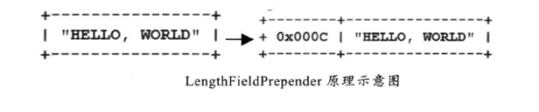
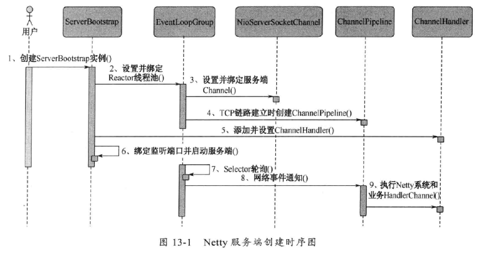
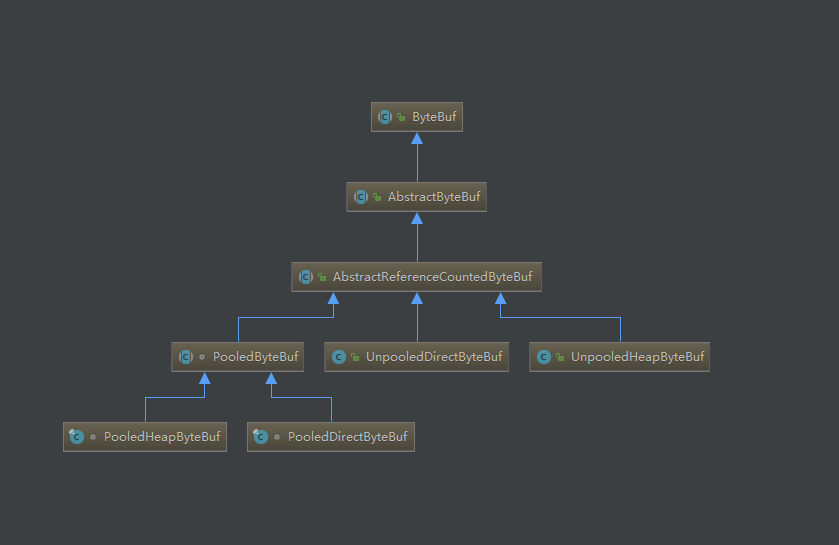
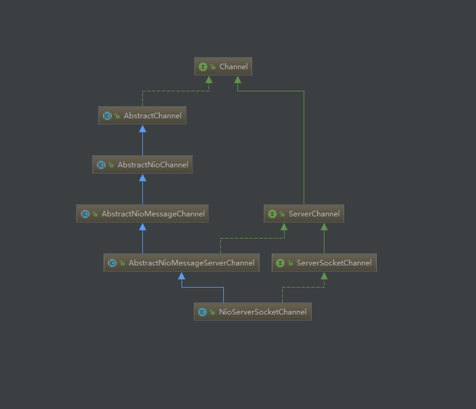
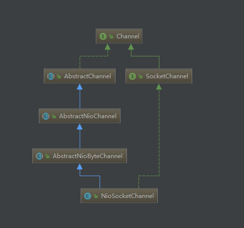

[TOC]
# Netty 权威指南

## 第一章 Java 的I/O演进之路

### 1.1 I/O基础

#### 1.1.1 Linux 网络I/O模型简介

根据 UNIX 网络编程对I/O模型的分类，UNIX 提供了 5 种I/O模型：

1. 阻塞 I/O 模型：缺省情形下，所有文件操作都是阻塞的。

2. 非阻塞 I/O 模型：recvfrom 从应用层到内核的时候，如果该缓冲区没有数据的话，就直接返回一个EWOULDBLOCK 错误，一般都对非阻塞 I/O 模型进行轮询检查这个状态，看内核是不是有数据到来。

3. I/O 复用模型：Linux 提供 selet/poll，进程通过将一个或多个 fd 传递给 select 或 poll 系统调用，阻塞在 select 操作上，这样 select/pool 可以帮我们侦测多个 fd 是否处于就绪状态。select/poll 时顺序扫描 fd 是否就绪，而且支持的 fd 数量有限。Linux 还提供了 epoll 系统调用，epoll 使用基于事件驱动方式代替顺序扫描，因此性能更高。当有 fd 就绪时，立即回调 rollback 函数。

4. 信号驱动 I/O 模型：首先开启套接口信号驱动 I/O 功能，并通过系统调用 sigaction 执行一个信号处理函数。当数据准备就绪时，就为该进程生成一个 SIGIO 信号，通过信号回调通知应用程序调用 recvform 来读取数据，并通知主循环函数处理数据。

5. 异步 I/O：告知内核启动某个操作，并让内核在整个操作完成后通知我们。这种模型与信号驱动的主要区别是：信号驱动 I/O 由内核通知我们何时可以开始一个 I/O 操作；异步 I/O 模型由内核通知我们 I/O 操作何时已经完成。

#### 1.1.2 I/O 多路复用技术

I/O 多路复用技术通过把多个 I/O 的阻塞复用到同一个 select 的阻塞上，从而使得系统在单线程的情况下可以同时处理多个客户端请求。与传统的多线程/多线程模型比，I/O 多路复用的最大优势是系统开销小，系统不需要创建新的额外进程或者线程，也不需要维护这些进程和线程的运行，降低了系统的维护工作量，节省了系统资源。

I/O 多路复用的主要应用场景如下：

- 服务器需要同时处理多个处于监听状态或者多个连接状态的套接字

- 服务器需要同时处理多种网络协议的套接字

epoll 的改进：

1. 支持一个进程打开的 select 描述符（FD）不受限制（仅受限于操作系统的最大文件句柄数）

select 最大的缺陷就是单个进程打开的 FD 是有一定限制的，它由 FD_SETSIZE 设置，默认值是 1024 。epoll 没有这个限制，它所支持的 FD 是操作系统的最大文件句柄数，这个数字远远大于 1024 。具体的值可以通过 `cat /proc/sys/fs/file-max` 查看。

2. I/O 效率不会随着 FD 数目的增加而线性下降

当拥有一个很大的 socket 集合时，由于网络延时或者链路空闲，任一时刻只有少部分的 socket 是“活跃”的，但 select/poll 每次调用都会线性扫描全部的集合，导致效率呈线性下降。epoll 只会对“活跃”的 socket 进行操作——epoll 是根据每个 fd 上面的 callback 函数实现的。所以，只有“活跃”的 socket 才会去主动调用 callback 函数，其他 idle 状态的 socket 则不会。

3. 使用 mmap 加速内核与用户空间的消息传递

无论是select、poll还是 epoll 都需要内核把 FD 消息通知给用户空间，如何避免不必要的内存复制就显得非常重要，epoll 是通过内核和用户空间 mmap 同一块内存来实现的。

4. epoll 的 API 更加简单

## 第二章 NIO 入门

### 2.1 传统的 BIO 编程

一个请求对应一个线程

#### 2.1.1 同步阻塞式 I/O 创建的 TimeServer 源码分析

[TimeServer.java](https://github.com/mmmoonie/netty-demo/blob/master/src/main/java/xyz/supermoonie/guid/ch02/TimeServer.java)

#### 2.1.2 同步阻塞式 I/O 创建的 TimeClient 源码分析

[TimeClient.java](https://github.com/mmmoonie/netty-demo/blob/master/src/main/java/xyz/supermoonie/guid/ch02/TimeClient.java)

### 2.2 伪异步 I/O 编程

通过一个线程池来处理多个客户端的请求接入，可以防止由于海量并发接入导致线程耗尽

#### 2.2.1 伪异步I/O 创建的 TimeServer 源码分析

[ExecutePoolTimeServer.java](https://github.com/mmmoonie/netty-demo/blob/master/src/main/java/xyz/supermoonie/guid/ch02/ExecutePoolTimeServer.java)

#### 2.2.2 伪异步I/O 的弊端

通过对Java输入和输出流的 API 文档进行分析，我们了解到读和写操作都是同步阻塞的，阻塞的时间取决于对方 I/O 线程的处理速度和网络 I/O 的传输速度。伪异步 I/O 仅仅是对 I/O 线程模型的一个简单优化，无法从根本上解决同步 I/O 导致的通信线程阻塞问题。

通信对方返回应答时间过长引起的级联故障：

1. 服务端处理缓慢

2. 采用伪异步 I/O 的线程正在读取故障服务节点的响应，由于读取输入流是阻塞的，它将会被阻塞

3. 假如所有的可用线程都被故障服务器阻塞，那后续所有的 I/O 消息都将在队列中排队

4. 由于线程池采用阻塞队列实现，当队列积满之后，后续入队列的操作将被阻塞

5. 由于前端只有一个 accptor 线程接收客户端接入，它将阻塞在线程池的同步阻塞队列之后，新的客户端请求消息将被拒绝，客户端会发生大量的连接超时

6. 由于几乎所有的连接都超时，调用者会认为系统已经崩溃，无法接收新的请求消息

### 2.3 NIO 编程

与 Socket 类和 ServerSocket 类相对应，NIO也提供了 SocketChannel 和 ServerSocketChannel 两种不同的套接字通道实现。这两种新增的通道都支持阻塞和非阻塞两种模式。

#### 2.3.1 NIO 类库简介

1. 缓冲区Buffer

  Buffer 是一个对象，它包含一些要写入或者要写出的数据。在 NIO 库中，所有数据都是用缓冲区处理的。在读取数据时，它是直接读到缓冲区中的；在写入数据时，写入到缓冲区。缓冲区实质上是一个数组。通常它是一个字节数组（ByteBuffer）。但是一个缓冲区不仅仅是一个数组，缓冲区还提供了对数据的结构化访问以及维护读写位置（limit）等信息。

2. 通道Channel

  Channel 是一个通道，网络数据通过Channel 读取和写入。通道与流的不同之处在于通道是双向的，流只是在一个方向上移动（一个流必须是InputStream或者OutputStream的子类），而通道可以用于读、写或者二者同时进行。

3. 多路复用器Selector

  多路复用器提供选择已经就绪的任务的能力。Selector 会不断地轮询注册在其上的Channel，如果某个Channel上面发生读或者写事件，这个Channel就处于就绪状态，会被Selector轮询出来，然后通过SlectionKey 可以获取就绪Channel的集合，进行后续的I/O操作。

  一个多路复用器Slector 可以同时轮询多个Channel，由于JDK使用了epoll() 代替传统的select 实现，所以它并没有最大连接句柄1024/2048 的限制。这也意味着只需要一个线程负责Selector 的轮询，就可以接入成千上万的客户端。

#### 2.3.2 NIO服务端序列图

```sequence
Note over NioServer:1.打开ServerSocketChannel
Note over NioServer:2.绑定监听地址InetSocketAdress
Note over Reactor Thread:3.创建Selector，启动线程
NioServer->Reactor Thread:4.将ServerSocketChannel注册到Selector，监听
Reactor Thread->ioHandler:5.Selector轮询就绪的key
ioHandler->Reactor Thread:6.handleAccept()处理新的客户端接入
Note over ioHandler:7.设置新建客户端连接的Socket参数
ioHandler->Reactor Thread:8.向Selector注册监听读操作SelectionKey.OP_READ
Reactor Thread->ioHandler:9.handleRead()异步读请求消息到ByteBuffer
Note over ioHandler:10.decode 请求消息
ioHandler->Reactor Thread:11.异步写ByteBuffer到SocketChannel
```

#### 2.3.3 NIO创建的TimeServer源码分析

[MultiplexerTimeServer.java](https://github.com/mmmoonie/netty-demo/blob/master/src/main/java/xyz/supermoonie/guid/ch02/MultiplexerTimeServer.java)

#### 2.3.4 NIO客户端序列图

```sequence
Note over NioClient:1. 打开SocketChannel
Note over NioClient:2. 设置SocketChannel 为非阻塞模式，同时设置TCP参数
NioClient->Server:3. 异步连接服务端
Note over NioClient:4. 判断连接结果，如果连接成功，跳到步骤 10，否则执行步骤 5
NioClient->Reactor Thread:5. 向Reactor 线程的多路复用器注册OP_CONNECT 事件
Note over Reactor Thread:6. 创建 Selector，启动线程
Note over Reactor Thread:7. Selector 轮询就绪的Key
Reactor Thread->ioHandler:8. handleConnect()
Note over ioHandler:9. 判断连接是否完成，完成执行步骤 10
ioHandler->Reactor Thread:10. 向多路复用器注册读事件 OP_READ
Reactor Thread->ioHandler:11. handleRead() 异步读请求消息到 ByteBuffer
Note over ioHandler:12. decode 请求消息
ioHandler->Reactor Thread:13. 异步写 ByteBuffer 到 SocketChannel
```

#### 2.3.5 NIO 创建的TimeClient源码分析

NIO 服务端开发步骤：

1. 创建 ServerSocketChannel，配置它为非阻塞模式
2. 绑定监听，配置 TCP 参数
3. 创建一个独立的 I/O 进程，用于轮询多路复用器 Selector
4. 创建 Selector，将之前创建的 ServerSocketChannel 注册到 Selector 上，监听 SelectionKey.ACCEPT
5. 启动 I/O 线程，在循环体中执行 Selector.select() 方法，轮询就绪的 Channel
6. 当轮询到了处于就绪状态的 Channel 时，需要对其进行判断，如果是 OP_ACCEPT 状态，说明是新的客户端接入，则调用 ServerSocketChannel.accept() 方法接受新的客户端
7. 设置新接入的客户端链路 SocketChannel 为非阻塞模式，配置其他的一些 TCP 参数
8. 将 SocketChannel 注册到 Selector，监听 OP_READ 操作位
9. 如果轮询的 Channel 为 OP_READ，则说明 SocketChannel 中有新的就绪的数据包需要读取，则构造 ByteBuffer 对象，读取数据包
10. 如果轮询的 Channel 为 OP_WRITE，说明还有数据没有发送完成，需要继续发送

[MultiplexerTimeClient.java](https://github.com/mmmoonie/netty-demo/blob/master/src/main/java/xyz/supermoonie/guid/ch02/MultiplexerTimeClient.java)

使用NIO编程的优点：

1. 客户端发起的连接操作是异步的，可以通过在多路复用器注册 OP_CONNECT 等待后续结果，不需要像之前的客户端那样被同步阻塞。
2. SocketChannel 的读写操作都是异步的，如果没有可读写的数据它不会同步等待，直接返回，这样I/O通信线程就可以处理其他的链路，不需要同步等待这个链路可用。

3. 线程模型的优化，没有连接句柄数限制，一个 Selector 线程可以同时处理成千上万的客户端连接，而且性能不会随着客户端的增加而线性下降，非常适合做高性能、高负载的网络服务器。

### 2.4 AIO 编程

NIO 2.0的异步套接字通道死真正的异步非阻塞I/O，对应于UNIX网络编程中的事件驱动I/O（AIO）。它不需要通过多路复用器（Selector）对注册的通道进行轮询操作即可实现异步读写，从而简化了 NIO 的编程模型。

#### 2.4.1 AIO 创建的 TimeServer 源码

[AsyncTimeServer.java](https://github.com/mmmoonie/netty-demo/blob/master/src/main/java/xyz/supermoonie/guid/ch02/AsyncTimeServer.java)

#### 2.4.2 AIO 创建的 TimeClient 源码

[AsyncTimeClient.java](https://github.com/mmmoonie/netty-demo/blob/master/src/main/java/xyz/supermoonie/guid/ch02/AsyncTimeClient.java)

### 2.5 4种 I/O 的对比

| | 同步阻塞I/O（BIO）| 伪异步I/O | 非阻塞I/O（NIO）| 异步I/O（AIO）|
| ---- | ---- | ---- | ---- | ---- |
| 客户端个数：I/O线程 | 1:1 | M:N（其中M可以大于N）| M：1（1个I/O线程处理多个客户端连接）| M:0（不需要启动额外的I/O线程，被动回调）|
| I/O类型（阻塞）| 阻塞I/O | 阻塞I/O | 非阻塞I/O | 非阻塞I/O |
| I/O类型（同步）| 同步I/O | 同步I/O | 同步I/O（I/O多路复用）| 异步I/O |
| API使用难度 | 简单 | 简单 | 非常复杂 | 复杂 |
| 调试难度 | 简单 | 简单 | 复杂 | 复杂 |
| 可靠性 | 非常差 | 差 | 高 | 高 |
| 吞吐量 | 低 | 中 | 高 | 高 |

### 2.6 选择 Netty 的理由

#### 2.6.1 不选择 Java 原生 NIO 编程的原因

1. NIO 的类库和API繁杂，使用麻烦

2. 需要具备其他的额外技能做铺垫，必须对多线程和网络编程非常熟悉，才能编写出高质量的 NIO 程序

3. 可靠性能力补齐，工作量和难度都非常大，NIO 编程的特点是功能开发相对容易，但是可靠性能力补齐的工作量和难度都非常大。

4. JDK NIO 的bug，例如 epoll bug 会导致 Selector 空轮询，最终导致 CPU 100%

#### 2.6.2 为什么选择 Netty（开始吹牛）

1. API 使用简单，开发门槛低
2. 功能强大，预置了多种编解码功能，支持多种主流协议
3. 定制能力强，可以通过 ChannelHandler 对通信框架进行灵活地扩展
4. 性能高，通过与其他业界主流的 NIO 框架对比，Netty 的综合性能最优
5. 成熟、稳定，Netty 修复了已经发现的所有 JDK NIO BUG
6. 社区活跃，版本迭代周期短
7. 经历了大规模的商业应用考验，质量得到验证

## 第三章 Netty 入门应用

### 3.1 Netty 服务端开发

[TimeServer.java](https://github.com/mmmoonie/netty-demo/blob/master/src/main/java/xyz/supermoonie/guid/ch03/TimeServer.java)

### 3.2 Netty 客户端开发

[TimeClient.java](https://github.com/mmmoonie/netty-demo/blob/master/src/main/java/xyz/supermoonie/guid/ch03/TimeClient.java)

## 第四章 TCP 粘包/拆包问题的解决之道

### 4.1 TCP 粘包/拆包

#### 4.1.1 TCP 粘包/拆包问题说明


假设客户端发送了两个数据包 D1 和 D2 给服务端，由于服务端一次读取的字节数是不确定的，所以有以下几种情况：

1. 服务端分两次读取到了两个独立的数据包，分别是 D1 和 D2 ，没有粘包也没有拆包
2. 服务端一次接收到了两个数据包，D1 和 D2 粘合在一起，被称为 TCP 粘包
3. 服务端分两次读到了两个数据包，第一次读取了完整的 D1 包和 D2 包的部分内容，第二次读取到了 D2 包的剩余内容，这被称为 TCP 拆包
4. 服务端分两次读到了两个数据包，第一次读取到了 D1 包的部分内容，第二次读取到了 D1 包的剩余内容和 D2 包的整包
5. 如果服务端 TCP 接受滑窗非常小，而数据包 D1 和 D2 非常大，服务器可能需要多次才能将 D1 和 D2 包接收完全，期间发生多次拆包

#### 4.1.2 TCP 粘包/拆包发生的原因

1. 应用程序写入数据的字节大小大于套接字缓冲区的大小
2. 进行 MSS 大小的 TCP 分段。MSS 是最大报文段长度的缩写。MSS是TCP报文段中的数据字段的最大长度。数据字段加上 TCP 首部才等于整个的 TCP 报文段。所以MSS并不是TCP报文段的最大长度，而是：MSS = TCP 报文段长度 - TCP 首部长度
3. 以太网的 payload 大于 MTU 进行 IP 分片。MTU 指：一种通信协议的某一层上面所能通过的最大数据包大小。如果IP层有一个数据包要传，而且数据的长度比链路层的 MTU 大，那么 IP 层就会进行分片，把数据包分成若干片，让每一片都不超过 MTU。注意，IP 分片可以发生在原始发送端主机上，也可以发生在中间路由器上。

#### 4.1.3 粘包问题的解决策略

1. 消息定长
2. 在包尾增加回车换行符进行分割，比如 FTP 协议
3. 将消息分为消息头和消息体，消息头中包含消息体总长度的字段
4. 更复杂的应用层协议

### 4.2 未考虑 TCP 粘包导致功能异常的案例

#### 4.2.1 TimeServer

[TimeServer.java](https://github.com/mmmoonie/netty-demo/blob/master/src/main/java/xyz/supermoonie/guid/ch04/TimeServer.java)

#### 4.2.2 TimeClient

[TimeClient.java](https://github.com/mmmoonie/netty-demo/blob/master/src/main/java/xyz/supermoonie/guid/ch04/TimeClient.java)

### 4.3 利用 LineBasedFrameDecoder 解决 TCP 粘包问题

#### 4.3.1 支持 TCP 粘包的 LineBasedFrameDecoderTimeServer

[LineBasedFrameDecoderTimeServer.java](https://github.com/mmmoonie/netty-demo/blob/master/src/main/java/xyz/supermoonie/guid/ch04/LineBasedFrameDecoderTimeServer.java)

#### 4.3.2 支持 TCP 粘包的 LineBaseFrameDecoderTimeClient

[LineBaseFrameDecoderTimeClient.java](https://github.com/mmmoonie/netty-demo/blob/master/src/main/java/xyz/supermoonie/guid/ch04/LineBaseFrameDecoderTimeClient.java)

#### 4.3.3 LineBasedFrameDecoder 与 StringDecoder 的原理分析 

LineBasedFrameDecoder 的工作原理是它依次遍历 ByteBuf 中的可读字节，判断看是否有 "\n" 或者 "\r\n"，如果有，就以此位置为结束位置，从可读索引到结束位置区间的字节就组成了一行。它是以换行符为结束标志的解码器，支持携带结束符或者不携带结束符两种编码方式，同时支持配置单行的最大长度。如果连续读取到最大长度后仍没有发现换行符，就会抛出异常，同时忽略掉之前读到的异常流码。

StringDecoder 的功能就是将接收到的对象转换成字符串，然后继续调用后面的 Handler

### 第五章 分隔符和定长解码器的应用

#### 5.1 DelimiterBasedFrameDecoder 开发

DelimiterBasedFrameDecoder 可以自动完成以分隔符作为流码结束标识的消息的解码

[DelimiterBasedFrameDecoderServer.java](https://github.com/mmmoonie/netty-demo/blob/master/src/main/java/xyz/supermoonie/guid/ch05/DelimiterBasedFrameDecoderServer.java)

[DelimiterBasedFrameDecoderClient.java](https://github.com/mmmoonie/netty-demo/blob/master/src/main/java/xyz/supermoonie/guid/ch05/DelimiterBasedFrameDecoderClient.java)

#### 5.2 FixedLengthFrameDecoder 开发

FixedLengthFrameDecoder 是固定长度解码器，它能够按照指定的长度对消息进行自动解码

[FixedLengthFrameDecoderServer.java](https://github.com/mmmoonie/netty-demo/blob/master/src/main/java/xyz/supermoonie/guid/ch05/FixedLengthFrameDecoderServer.java)

### 第六章 编解码技术

### 6.1 Java 序列化的缺点

1. 无法跨语言

2. 序列化后的码流太大

   基于 ByteBuffer 的通用二进制编码技术与传统的 JDK 序列化后的码流大小对比

   [UserInfo.java](https://github.com/mmmoonie/netty-demo/blob/master/src/main/java/xyz/supermoonie/guid/ch06/UserInfo.java)

   [TestUserInfo.java](https://github.com/mmmoonie/netty-demo/blob/master/src/main/java/xyz/supermoonie/guid/ch06/TestUserInfo.java)

   影响编解码优劣的因素：

   - 是否支持跨语言，支持的语言种类是否丰富
   - 编码后的码流大小
   - 编解码的性能
   - 类库是否小巧，API 使用是否方便
   - 使用者需要手工开发的工作量和难度

3. 序列化性能太低

   [PerformTestUserInfo.java](https://github.com/mmmoonie/netty-demo/blob/master/src/main/java/xyz/supermoonie/guid/ch06/PerformTestUserInfo.java)


### 6.2 业界主流的编解码框架

#### 6.2.1 Google 的 Protobuf 

特点：

- 结构化数据格式（xml、json 等）
- 高效的编解码性能
- 语言无关、平台无关、扩展性好
- 官方支持 java、c++ 和 python 三种语言

#### 6.2.2 Facebook 的 Thrift

- Thrift 是为了解决系统间大量数据的传输通信以及系统之间语言环境不同需要跨平台的特性。
- Thrift 支持 C++、C#、Cocoa、Erlang、Haskell、Java、Ocami、Perl、PHP、Python、Ruby 和 SmallTack
- Thrift 适合于静态的数据交换，需要首先确定好它的数据结构，当数据结构发生变化时，必须重新编辑 IDL 文件，生成代码和编译，这一点是弱项。

#### 6.2.3 JBoss Marshalling

相对于 java 序列化，有以下优点：

- 可插拔的类解析器，提供更加便捷的类加载定制策略，通过一个接口即可实现定制
- 可插拔的对象替换技术，不需要通过继承的方式
- 可插拔的预定义类缓存表，可以减小序列化的字节数组长度，提升常用类型的对象序列化性能
- 无需实现 java.io.Serializable 接口，即可实现 java 序列化
- 通过缓存技术提升对象的序列化性能

## 第七章 MessagePack 编解码

MessagePack 是一个高效的二进制序列化框架，它像 JSON 一样支持不同语言间的数据交换，但是它的性能更快，序列化后的码流也更小。

### 7.1 MessagePack 编码器和解码器开发

#### 7.1.1 MessagePack 编码器开发

[MsgpackEncoder.java](https://github.com/mmmoonie/netty-demo/blob/master/src/main/java/xyz/supermoonie/guid/ch07/MsgpackEncoder.java)

#### 7.1.2 MessagePack 解码器开发

[MsgpackDecoder.java](https://github.com/mmmoonie/netty-demo/blob/master/src/main/java/xyz/supermoonie/guid/ch07/MsgpackDecoder.java)

### 7.2 粘包/半包支持

```java
ch.pipeline().addLast(new LengthFieldBasedFrameDecoder(65535, 0, 2, 0, 2));
ch.pipeline().addLast(new MsgpackDecoder());
ch.pipeline().addLast(new LengthFieldPrepender(2));
ch.pipeline().addLast(new MsgpackEncoder());
```

new LengthFieldPrepender(2) 将在 ByteBuf 之前增加 2 个字节的消息长度字段，其原理如图所示：



LengthFieldBasedFrameDecoder 构造参数说明：

```java
public LengthFieldBasedFrameDecoder(
    ByteOrder byteOrder, 
    int maxFrameLength, 
    int lengthFieldOffset, 
    int lengthFieldLength,
    int lengthAdjustment, 
    int initialBytesToStrip, 
    boolean failFast) {
    
}
```

- byteOrder：表示字节流是大端还是小端
- maxFrameLength：数据包的最大字节数，超出长度会抛出 TooLongFrameException 异常
- lengthFieldOffset：获取长度字段的偏移量，即跳过多少字节才能到达获取长度域的位置
- lengthFieldLength：长度域占用的字节数
- lengthAdjustment：长度补偿值，即 lengthFieldOffset + lengthFieldLength + lengthAdjustment = header
- initialBytesToStrip：获取完一个完整的数据包之后，忽略前面的指定的位数个字节 ，即忽略掉 lengthFieldOffset + lengthFieldLength + lengthAdjustment
- failFast：如果为true，则表示读取到长度域，TA的值的超过maxFrameLength，就抛出一个 TooLongFrameException，而为false表示只有当真正读取完长度域的值表示的字节之后，才会抛出 TooLongFrameException，默认情况下设置为true，建议不要修改，否则可能会造成内存溢出

## 第八章 Google Protobuf 编解码

## 第九章 JBoss Marshaling 编解码

## 第十章 HTTP 协议开发应用

## 第十三章 服务端创建

### 13.1 Netty 服务端创建时序图



**Netty 服务器端创建的关键步骤：**

1. 创建 ServerBootstrap 实例。ServerBootstrap 是Netty 服务端的启动辅助类，提供了一系列方法用于设置服务端启动相关的参数。底层通过门面模式对各种能力进行抽象和封装。
2. 设置并绑定Reactor 线程池。Netty 的 Reactor 线程池是 EventLoopGroup，实际上就是 EventLoop 的数组。EventLoop 的职责是处理所有注册到本线程多路复用器 Selector 上的 Channel，Selector 的轮询操作由绑定的 EventLoop 线程 run 方法驱动，在一个循环体内循环执行。
3. 设置并绑定服务端 Channel。ServerBootstrap 提供了 channel 方法用于指定服务端 Channel 的类型。Netty 通过工厂类，利用反射创建 NioServerSocketChannel 对象。
4. 链路建立时创建并初始化 ChannelPipeline。ChannelPipeline 并不是 NIO 服务端必须的，它本质是一个负责处理网络事件的责任链，负责管理和执行 ChannelHandler。网络事件以事件流的形式在 ChannelPipeline 中流转，由 ChannelPipeline 根据 ChannelHandler 的执行策略调度 ChannelHandler 的执行。
5. 初始化 ChannelPipoline 完成后，添加并设置 ChannelHandler。ChannelHandler 可以完成大多数的功能定制，例如消息编解码、心跳、安全认证、TSL/SSL 认证、流量控制和流量整形等。
6. 绑定并启动监听端口。在绑定监听端口之前会做一系列的初始化和检测工作，完成之后，启动监听端口，并将 ServerSocketChannel 注册到 Selector 上监听客户端连接。
7. Selector 轮询。由Reactor 线程 NioEventLoop 负责调度和执行 Selector 轮询操作，选择准备就绪的 Channel 集合。
8. 当轮询到准备就绪的 Channel 之后，就由 Reactor 线程 NioEventLoop 执行 ChannelPipeline 的相应方法，最终调度并执行 ChannelHandler。
9. 执行 Netty 系统 ChannelHandler 和用户添加的 ChannelHandler。

比较使用的系统 ChannelHandler：

- ByteToMessageCodec：系统编解码框架
- LengthFieldBasedFrameDecoder：基于长度的半包解码器
- LoggingHandler：流码日志打印Handler
- SslHandler：SSL 安全认证Handler
- IdleStateHandler：链路空闲检测Handler
- ChannelTrafficShapingHander：流量整形Handler
- Base64Decoder 和 Base64Decoder：Base64 编解码

### 13.2 Netty 服务端创建源码分析

首先创建 ServerBootstrap 实例：

```java
ServerBootstrap bootstrap = new NioEventLoopGroup();
EventLoopGroup acceptorGroup = new NioEventLoopGroup();
EventLoopGroup ioGroup = new NioEventLoopGroup();
bootstrap.group(acceptorGroup, ioGroup)
    .channel(NioServerSocketChannel.class)
    .option(ChannelOption.SO_BACKLOG, 100);
```

随后创建 EventLoopGroup，EventLoopGroup 并不是必须要创建两个不同的 EventLoopGroup，也可以只创建一个并共享。NioEventLoopGroup 实际就是 Reactor 线程池，负责调度和执行客户端的接入、网络读写事件的处理、用户自定义任务和定时任务的执行。通过 ServerBootstrap 的 group 方法将两个 EventLoopGroup 实例传入：

```java
public ServerBootstrap group(EventLoopGroup parentGroup, EventLoopGroup childGroup) {
    super.group(parentGroup);
    if (childGroup == null) {
        throw new NullPointerException("childGroup");
    }
    if (this.childGroup != null) {
        throw new IllegalStateException("childGroup set already");
    }
    this.childGroup = childGroup;
    return this;
}
```

其中 parentGroup被传入父类构造方法中：

```java
public B group(EventLoopGroup group) {
    if (group == null) {
        throw new NullPointerException("group");
    }
    if (this.group != null) {
        throw new IllegalStateException("group set already");
    }
    this.group = group;
    return self();
}
```

该方法用于设置工作 I/O 线程，执行和调度网络事件的读写。

线程组和线程类型设置完成后，需要设置服务端 Channel 用于端口监听和客户端链路接入。Netty 通过 Channel 工厂类来创建不同类型的 Channel。所以，通过指定 Channel 类型的方式创建 Channel 工厂。

```java
public B channel(Class<? extends C> channelClass) {
    if (channelClass == null) {
        throw new NullPointerException("channelClass");
    }
    return channelFactory(new ReflectiveChannelFactory<C>(channelClass));
}
```

ReflectiveChannelFactory.java：

```java
@Override
public T newChannel() {
    try {
        return clazz.getConstructor().newInstance();
    } catch (Throwable t) {
        throw new ChannelException("Unable to create Channel from class " + clazz, t);
    }
}
```

ReflectiveChannelFactory 根据 Channel 的类型通过反射创建 Channel 的实例。

指定 NioServerSocketChannel 后，需要设置 TCP 的一些参数，作为服务端，主要设置 TCP 的 backlog 参数，backlog 制定了内核为此套接口排队的最大连接个数，对于给定的监听套接口，内核要维护两个队列：未连接队列和已连接队列，根据 TCP 三次握手过程中的三个分节来分隔这两个队列。收到客户端 syn 分节时在未完成队列中创建一个新的条目，三次握手完成，该条目从未完成连接队列搬到已完成队列尾部。当进程调用 accept 时，从已完成队列中的头部取出一个条目。Netty 默认的 backlog 为 100.

TCP 参数设置完成后，可以为启动辅助类和其父类分别指定 Handler。两类的用途不同：子类中的Handler 是 NioServerSocketChannel 对应的 ChannelPipeline 的 Handler；父类中的 Handler 是客户端新接入的连接 SocketChannel 对应的 ChannelPipoline 的Handler。本质区别是：ServerBootstrap 中的Handler 是NioServerSocketChannel 使用的，所有连接该监听端口的客户端都会执行它；父类 AbstractBootstrap 中的 Handler 是个工厂类，它为每个新接入的客户端都创建一个新的 Handler。


## 第十五章Bytebuf 和相关辅助类

### 15.1 ByteBuf 功能说明

ByteBuffer 的局限性：

- ByteBuffer 长度固定，不能动态扩展和伸缩
- ByteBuffer 只有一个标识位置的指针 position，读写时需调用 flip() 和 rewind()，增加了复杂性
- ByteBuffer 的功能有限，不支持一些高级的功能和特性

#### 15.1.1 ByteBuf 的工作原理

ByteBuf 通过两个位置指针来协助缓冲区的读写操作，读操作使用 readerIndex ，写操作使用 writerIndex 。

readerIndex 和 writerIndex 的取值一开始都是 0，随着数据的写入 writerIndex 会增加，读取数据会使 readerIndex 增加，但不会超过 writerIndex。在读取之后，0 ~ readerIndex 被视为 discard 的，调用 discardReadBytes 方法，可释放这部分空间。readerIndex 和 writerIndex 之间的数据是可读的。writerIndex 和 capacity 之间的空间是可写的。

ByteBuf 的动态扩展：ByteBuf 对 write 操作进行了封装，由 ByteBuf 的 write 操作负责进行剩余可用空间的校验。如果可用缓冲区不足，ByteBuf 会自动进行动态扩展。考虑到性能，应该尽量避免缓冲区的复制。

#### 15.1.2 ByteBuf 的功能说明

- 顺序读操作（read）类似于ByteBuffer 的 get 操作

- 顺序写操作（write）类似于 ByteBuffer 的 put 操作

- Discardable bytes，相比于其他的 Java 对象，缓冲区的分配和释放是个耗时的操作。由于缓冲区的动态扩张需要进行字节数组的复制，这是个耗时的操作，因此应尽量重用缓冲区，然而，调用 discardReadBytes 会发生字节数组的内存复制，因此，频繁调用将会导致性能下降。

- Clear 操作，并不会清空缓冲区中内容，而是将 readerIndex 和 writerIndex 还原为初始值

- Mark 和 Reset ，因为 ByteBuf 有读索引和写索引，因此有 4  个相关的方法：

  - markReaderIndex
  - resetReaderIndex
  - markWriterIndex
  - resetWriterIndex

- 查找操作

  - indexOf(int fromIndex, int toIndex, byte value)
  - bytesBefore(byte value)：从 readereIndex 到 writerIndex 中查找
  - bytesBefore(int length, byte value)：从 readerIndex 到 readerIndex + length 中查找
  - bytesBefore(int index, int length, byte value)：从 index 到 index + length 中查找
  - forEachByte(ByteBufProcessor processor)：遍历可读字节数组，与 ByteBufferProcessor 设置的条件进行比较
  - forEachByte(int index, int length, ByteBufProcessor processor)
  - forEachByteDesc(ByteBufProcessor processor)：逆序遍历可读字节数组进行查找
  - forEachByteDesc(int index, int length, ByteBufProcessor processor)

  ByteBufProcessor 对常用的查找字节进行了抽象：

  - FIND_NUL: NUL (0X00)
  - FIND_CR: CR ('\r')
  - FIND_LF: LF('\n')
  - FIND_CRLF: CR ('\r') 或 LF ('\n')
  - FIND_LINEAR_WHITESPACE: '    ' 或 '\t'

- Derived buffers

  - duplicate：复制，拥有独立索引，持有同一个内容指针引用
  - copy：内容与索引都是独立的
  - copy(int index, int lenght)：内容与索引都是独立的
  - slice：返回可读子缓冲区，内容共享，索引独立
  - slice(int index, int length)

- 转换成标准的 ByteBuffer

  - nioBuffer()：共享同一个缓冲区内容的应用
  - nioBuffer(int index, int length)：共享同一个缓冲区内容的引用

- 随机读写（set 和 get）

  无论是 set 还是 get ，ByteBuf 都会对索引和长度进行合法性校验，但 set 与 write 的不同是 set 不支持动态扩展缓冲区

### 15.2 ByteBuf 源码分析

#### 15.2.1 ByteBuf 的主要类继承关系



从内存分配上看，ByteBuf 分为两类：

- 堆内存（HeapByteBuf）字节缓冲区：内存的分配回收块，可以被 JVM 自动回收，但如果进行 Socket 的 I/O 读写，需要做一次额外的内存复制，性能有所下降
- 直接内存（DirectByteBuf）字节缓冲区：在堆外进行内存分配，分配回收慢，但不需要从Socket Channel 中复制

ByteBuf 的最佳实践：在 I/O 通信线程的读写缓冲区使用 DirectByteBuf，后端业务消息的编解码使用 HeapByteBuf

从内存回收的角度看，ByteBuf  也分为两类：

- 基于对象池的ByteBuf：可重用 ByteBuf 对象，自己维护一个内存池，可以循环利用创建的 ByteBuf，提升内存使用效率，降低高负载下的频繁 GC
- 普通的ByteBuf

#### 15.2.2 AbstractByteBuf 源码分析

- 主要成员变量

  读索引、写索引、mark、最大容量等公共属性需要定义，所有的 ByteBuf 共享一个 ResourceLeakDetector ，ResourceLeakDetector 主要用于检测对象是否泄漏。

- 读操作簇，以 readBytes(byte[] dst, int dstIndex, int length) 为例

  ```java
  public ByteBuf readBytes(byte[] dst, int dstIndex, int length) {
      checkReadableBytes(length);
      getBytes(readerIndex, dst, dstIndex, length);
      readerIndex += length;
      return this;
  }
  
  protected final void checkReadableBytes(int minimumReadableBytes) {
      ensureAccessible();
      if (minimumReadableBytes < 0) {
          throw new IllegalArgumentException("minimumReadableBytes: " + minimumReadableBytes + " (expected: >= 0)");
      }
      if (readerIndex > writerIndex - minimumReadableBytes) {
          throw new IndexOutOfBoundsException(String.format(
                  "readerIndex(%d) + length(%d) exceeds writerIndex(%d): %s",
                  readerIndex, minimumReadableBytes, writerIndex, this));
      }
  }
  
  ```

  通过校验后，调用 getBytes 方法，该方法由不同的子类实现

- 写操作簇，以 writeBytes(byte[] src, int srcIndex, int length) 为例

  ```java
  public ByteBuf writeBytes(byte[] src, int srcIndex, int length) {
      ensureWritable(length);
      setBytes(writerIndex, src, srcIndex, length);
      writerIndex += length;
      return this;
  }
  ```

  ```java
  @Override
  public ByteBuf ensureWritable(int minWritableBytes) {
      if (minWritableBytes < 0) {
          throw new IllegalArgumentException(String.format(
                  "minWritableBytes: %d (expected: >= 0)", minWritableBytes));
      }
  
      if (minWritableBytes <= writableBytes()) {
          return this;
      }
  
      if (minWritableBytes > maxCapacity - writerIndex) {
          throw new IndexOutOfBoundsException(String.format(
                  "writerIndex(%d) + minWritableBytes(%d) exceeds maxCapacity(%d): %s",
                  writerIndex, minWritableBytes, maxCapacity, this));
      }
  
      // Normalize the current capacity to the power of 2.
      int newCapacity = calculateNewCapacity(writerIndex + minWritableBytes);
  
      // Adjust to the new capacity.
      capacity(newCapacity);
      return this;
  }
  ```

  JDK ByteBuffer 一个最大的缺点就是一旦完成分配之后不能动态调整其容量。由于不能确定需要编解码的POJO 的长度，因此只能给出估计值。如果值偏大，会造成内存浪费，如果偏小，当遇到大的 POJO 时就会发生益处异常，这时需要手动捕获这个异常，并重新计算缓冲区的大小。

  Netty ByteBuf 可以动态扩展，允许指定最大容量，在容量范围内，先分配一个较小的初始容量，后面不够可以动态扩展。

  ```java
  private int calculateNewCapacity(int minNewCapacity) {
      final int maxCapacity = this.maxCapacity;
      final int threshold = 1048576 * 4; // 4 MiB page
  
      if (minNewCapacity == threshold) {
          return threshold;
      }
  
      // If over threshold, do not double but just increase by threshold.
      if (minNewCapacity > threshold) {
          int newCapacity = minNewCapacity / threshold * threshold;
          if (newCapacity > maxCapacity - threshold) {
              newCapacity = maxCapacity;
          } else {
              newCapacity += threshold;
          }
          return newCapacity;
      }
  
      // Not over threshold. Double up to 4 MiB, starting from 64.
      int newCapacity = 64;
      while (newCapacity < minNewCapacity) {
          newCapacity <<= 1;
      }
  
      return Math.min(newCapacity, maxCapacity);
  }
  ```

  首先设置阈值为 4MB，当需要的新容量正好等于阈值时，使用阈值作为缓冲区容量。如果新申请的内存空间大于阈值，不能采用倍增的方式（放置内存膨胀和浪费），而是采用每次步进 4MB 的方式进行扩张。扩张的时候需要对扩张后的内存和最大内存进行比较，如果大于缓冲区的最大长度，则使用 maxCapacity 作为扩张后的缓冲区容量。如果扩张后的新容量小于阈值，则以 64 为计数进行倍增，直到倍增后的结果大于或等于需要的容量值。

  采用倍增或步进算法的原因是：如果以 minNewCapacity 作为目标容量，则本次扩容后的可写字节数刚好够本次写入使用。写入完成后，可写字节数会变为 0，下次写入操作时，需要再次动态扩张。这样第一次扩张后的每次写入操作都要进行动态扩张，频繁的内存复制会导致性能下降。

  采用先倍增后步进的原因是：当内存较小的情况下，倍增操作并不会造成太多的内存浪费。但当内存增长到一定阈值后继续使用倍增操作可能会带来额外的内存浪费。

- 操作索引，以 readerIndex(int readerIndex) 为例

  ```java
  public ByteBuf readerIndex(int readerIndex) {
      if (readerIndex < 0 || readerIndex > writerIndex) {
          throw new IndexOutOfBoundsException(String.format(
                  "readerIndex: %d (expected: 0 <= readerIndex <= writerIndex(%d))", readerIndex, writerIndex));
      }
      this.readerIndex = readerIndex;
      return this;
  }
  ```

- 重用缓冲区

  ```java
  public ByteBuf discardReadBytes() {
      ensureAccessible();
      if (readerIndex == 0) {
          return this;
      }
  
      if (readerIndex != writerIndex) {
          setBytes(0, this, readerIndex, writerIndex - readerIndex);
          writerIndex -= readerIndex;
          adjustMarkers(readerIndex);
          readerIndex = 0;
      } else {
          adjustMarkers(readerIndex);
          writerIndex = readerIndex = 0;
      }
      return this;
  }
  ```

  ```java
  protected final void adjustMarkers(int decrement) {
      int markedReaderIndex = this.markedReaderIndex;
      if (markedReaderIndex <= decrement) {
          this.markedReaderIndex = 0;
          int markedWriterIndex = this.markedWriterIndex;
          if (markedWriterIndex <= decrement) {
              this.markedWriterIndex = 0;
          } else {
              this.markedWriterIndex = markedWriterIndex - decrement;
          }
      } else {
          this.markedReaderIndex = markedReaderIndex - decrement;
          markedWriterIndex -= decrement;
      }
  }
  ```

- skipBytes

  丢弃或跳过不需要读区的字节或字节数组。

#### 15.2.3 AbstractReferenceCountedByteBuf 源码分析

- 成员变量

  ```java
  private static final AtomicIntegerFieldUpdater<AbstractReferenceCountedByteBuf> refCntUpdater =
          AtomicIntegerFieldUpdater.newUpdater(AbstractReferenceCountedByteBuf.class, "refCnt");
  
  private static final long REFCNT_FIELD_OFFSET;
  
  static {
      long refCntFieldOffset = -1;
      try {
          if (PlatformDependent.hasUnsafe()) {
              refCntFieldOffset = PlatformDependent.objectFieldOffset(
                      AbstractReferenceCountedByteBuf.class.getDeclaredField("refCnt"));
          }
      } catch (Throwable t) {
          // Ignored
      }
  
      REFCNT_FIELD_OFFSET = refCntFieldOffset;
  }
  
  @SuppressWarnings("FieldMayBeFinal")
  private volatile int refCnt = 1;
  ```

  refCntUpdater 通过原子的方式对成员变量进行更新操作，以实现线程安全，消除锁。

  REFCNT_FIELD_OFFSET 用于标示 refCnt 在 AbstractReferenceCountedByteBuf 中的内存地址，该内存地址的获取与 JDK 实现强相关。

  refCnt 用于跟踪对象的引用计数。

- 对象引用计数器

  ```java
  public ByteBuf retain() {
      for (;;) {
          int refCnt = this.refCnt;
          if (refCnt == 0) {
              throw new IllegalReferenceCountException(0, 1);
          }
          if (refCnt == Integer.MAX_VALUE) {
              throw new IllegalReferenceCountException(Integer.MAX_VALUE, 1);
          }
          if (refCntUpdater.compareAndSet(this, refCnt, refCnt + 1)) {
              break;
          }
      }
      return this;
  }
  ```

  每调用一次 retain() 引用计数器就会加一，通过自旋对引用计数器进行加一。

  ```java
  public final boolean release() {
      for (;;) {
          int refCnt = this.refCnt;
          if (refCnt == 0) {
              throw new IllegalReferenceCountException(0, -1);
          }
  
          if (refCntUpdater.compareAndSet(this, refCnt, refCnt - 1)) {
              if (refCnt == 1) {
                  deallocate();
                  return true;
              }
              return false;
          }
      }
  }
  ```

  调用 release() 释放引用计数器，当 refCnt == 1 时，意味着申请与释放相等，对象引用已经不可达，该对象需要被释放和垃圾回收掉。

#### 15.2.4 UnpooledHeapByteBuf 源码分析

UnpooledHeapByteBuf 是基于堆内存进行内存分配的字节缓冲区，没有基于对象池技术实现，意味着每次 I/O 的读写都会创建一个新的 UnpooledHeapByteBuf，频繁进行大块内存的分配和回收对性能会有一定的影响，但比堆外内存的申请和释放，它的成本会低一些。

相比较于 PooledHeapByteBuf ，UnpooledHeapByteBuf 实现简单，也不容易出现内存管理上的问题，因此在性能满足的情况下，尽量使用 UnpooledHeapByteBuf。

- 成员变量

  ```java
  private final ByteBufAllocator alloc;
  private byte[] array;
  private ByteBuffer tmpNioBuf;
  ```

  ByteBufAllocator 用于 UnpooledHeapByteBuf 的内存分配，tmpNioBuf 用于实现 Netty ByteBuf 到 Java ByteBuffer 的转换。

- 动态扩展缓冲区

  ```java
  public ByteBuf capacity(int newCapacity) {
      ensureAccessible();
      if (newCapacity < 0 || newCapacity > maxCapacity()) {
          throw new IllegalArgumentException("newCapacity: " + newCapacity);
      }
  
      int oldCapacity = array.length;
      if (newCapacity > oldCapacity) {
          byte[] newArray = new byte[newCapacity];
          System.arraycopy(array, 0, newArray, 0, array.length);
          setArray(newArray);
      } else if (newCapacity < oldCapacity) {
          byte[] newArray = new byte[newCapacity];
          int readerIndex = readerIndex();
          if (readerIndex < newCapacity) {
              int writerIndex = writerIndex();
              if (writerIndex > newCapacity) {
                  writerIndex(writerIndex = newCapacity);
              }
              System.arraycopy(array, readerIndex, newArray, readerIndex, writerIndex - readerIndex);
          } else {
              setIndex(newCapacity, newCapacity);
          }
          setArray(newArray);
      }
      return this;
  }
  ```

  判断新的容量值是否大于当前的缓冲区容量，如果大于则需要进行动态扩容，然后通过 System.arraycopy 进行内存复制。如果新的容量小于当前的缓冲区容量，则不需要动态扩容，但需要创建一个新的缓冲区：首先判断读索引是否小于新的容量值，如果小于进一步判断写索引是否大于新的容量值，如果大于则将写索引设置为新的容量值，然后进行内存复制；如果读索引大于等于新的容量值，则丢弃读索引后面的收据，将读写索引设置为新的容量值。

- 字节数组复制

  ```java
  public ByteBuf setBytes(int index, byte[] src, int srcIndex, int length) {
      checkSrcIndex(index, length, srcIndex, src.length);
      System.arraycopy(src, srcIndex, array, index, length);
      return this;
  }
  ```

- 转换成 JDK ByteBuffer

  ```java
  public static ByteBuffer wrap(byte[] array,
                                  int offset, int length)
  {
      try {
          return new HeapByteBuffer(array, offset, length);
      } catch (IllegalArgumentException x) {
          throw new IndexOutOfBoundsException();
      }
  }
  ```

  ```java
  public ByteBuffer nioBuffer(int index, int length) {
      ensureAccessible();
      return ByteBuffer.wrap(array, index, length).slice();
  }
  ```

- 子类实现相关的方法

  - idDirect() ：基于堆内存实现的 ByteBuffer ，返回 false
  - hasArray() ：基于字节数组实现，返回 true
  - array() ：基于字节数组实现，返回内部的字节数组变量
  - 其他本地相关的方法：arrayOffset()、hasMemoryAddress()、memoryAddress()

#### 15.2.5 PooledByteBuf 内存池原理分析

- PoolArena

  Netty 的内存池实现类，PoolArena 是由多个 Chunk 组成的大块内存区域，每个 Chunk 则由一个或者多个 Page 组成。

- PoolChunk

  Chunk 主要用来组织和管理多个 Page 的内存分配和释放，在 Netty 中，Chunk 中的Page 被构建成一棵二叉树。

- PoolSubpage

  每个 Page 会被分成大小相等的多个存储块，存储块的大小由第一次申请的内存块大小决定。

- 内存回收策略

#### 15.2.6 PooledDirectByteBuf 源码分析

与 UnPooledDirectByteBuf 唯一的不同就是内存分配策略不同。

- 创建字节缓冲区实例

  ```java
  static PooledDirectByteBuf newInstance(int maxCapacity) {
      PooledDirectByteBuf buf = RECYCLER.get();
      buf.setRefCnt(1);
      buf.maxCapacity(maxCapacity);
      return buf;
  }
  ```

- 复制新的字节缓冲区实例

  copy(int index, int length) newDirectBuffer()

- 子类实现相关的方法

### 15.3 ByteBuf 相关的辅助类

- ByteBufHolder：ByteBuf 的容器
- ByteBufAllocator：字节缓冲区的分配器，按照缓冲区实现不同，分为两种：
  - 基于内存池的字节缓冲区
  - 普通的字节缓冲区
- CompositeByteBuf：允许将多个 ByteBuf 的实例组装在一起
- ByteBufUtil：
  - encodeString(ByteBufAllocator alloc, CharBuffer src, Charset charset)
  - decodeString(ByteBuffer src, Charset charset)

## 第十六章 Channel 和 Unsafe

### 16.1 Channel  功能说明

#### 16.1.1 Channel 的工作原理

不适用JDK NIO 原生Channel 的原因：

- JDK 的 SocketChannel 和 ServerSocketChannel 没有统一的 Channel 接口
- JDK 的 SocketChannel 和 ServerSocketChannel 是 SPI 类接口，扩展难度大
- Netty 的 Channel 能够跟 Netty 的整体架构融合在一起
- 自定义的 Channel 功能实现更灵活

Netty Channel 的主要设计理念：

- Channel 接口采用 Facade 模式统一封装
- Channel 接口尽量大而全，为 SocketChannel 和 ServerSocketChannel 提供统一的视图
- 采用聚合而非包含的方式，将相关的功能类聚合在 Channel 中

#### 16.1.2 Channel 的功能介绍

1. 网络I/O操作
   1. Channel read()：从当前的 Channel 中读取数据到第一个 inbound 缓冲区中，如果数据被成功读取，触发ChannelHandler.channelRead(ChannelHandlerContext, Object) 事件。读取操作 API 调用完成后，紧接着会触发 ChannelHandler.channelReadComplete(ChannelHandlerContext) 事件，这样业务的 ChannelHandler 可以决定是否需要继续读取数据。如果已经有读操作请求被挂起，则后续的读操作会被忽略。
   2. ChannelFuture write(Object msg)：将当前的 msg 通过 ChannelPipeline 写入到目标 Channel 中。write  操作只是将消息存入发送环形数组中，并没有真正被发送，只有调用 flush 才会被写入到 Channel 中。
   3. ChannelFuture write(Object msg, ChannelPromise promise)：与 write 相同，但携带了 ChannelPromise 负责设置写入操作的结果
   4. ChannelFuture writeAndFlush(Objecg msg, ChannelPromise promie)：等价于方法 3 再加上 flush 调用
   5. ChannelFuture writeAndFlush(Object msg)：write + flush
   6. Channel flush()：将之前存入发送环形数组的信息全部写入到目标 Channel 中。
   7. ChannelFuture close(ChannelPromise promise)：主动关闭当前连接，通过 ChannelPromise 设置操作结果并进行结果通知，无论操作是否成功，都可以通过 ChannelPromise 获取操作结果。该操作会级联触发ChannelPipeline 中所有 ChannelHandler 的 ChannelHandler.close(ChannelHandlerContext, ChannelPromise) 事件
   8. ChannelFuture disconnect(ChannelPromise promise)：请求断开连接并使用 ChannelPromise 来获取操作结果的通知消息。该方法会级联触发 ChannelHandler.disconnect(ChannelHandlerContext, ChannelPromise) 事件
   9. ChannelFuture connect(SocketAddress remoteAddress)：向 remoteAddress 发起连接请求，如果连接应答超时，ChannelFuture 中的结果就是 ConnectTimeoutException ；如果连接被拒绝，操作结果为 ConnectException 。该方法会级联触发 ChannelHandler.connect(ChannelHandlerContext, SocketAddress, SocketAddress, ChannelPromise) 事件
   10. ChannelFuture connect(SocketAddress remoteAddress, SocketAddress localAddress)：先绑定指定的本地地址后再连接服务端
   11. ChannelFuture connect(SocketAddress remoteAddress, ChannelPromise promise)：携带了 ChannelPromise 参数用于写入操作结果
   12. connect(SocketAddress remoteAddress, SocketAddress localAddress, ChannelPromise promise)
   13. ChannelFuture bind(SocketAddress localAddress)：绑定本地 Socket 地址，该方法会级联触发 ChannelHandler.bind(ChannelHandlerContext, SocketAddress, ChannelPromise) 事件
   14. ChannelFuture bind(SocketAddress localAddress, ChannelPromise promise)
   15. ChannelConfig config()：获取当前 Channel 的配置信息
   16. boolean isOpen()：判断当前 Channel 是否打开
   17. boolean isRegistered()：判断当前Channel 是否已经注册到 EventLoop 上
   18. boolean isActive()：判断当前 Channel 是否已经处于激活状态
   19. ChannelMetadata metadata()：获取当前 Channel 的元数据描述信息，包括 TCP 参数配置
   20. SocketAddress localAddress()：获取当前 Channel 的本地绑定地址
   21. SocketAddress remoteAddress()：获取当前Channel 的远程 Socket 地址
2. 其他常用的API 功能说明
   1. eventLoop()：获取Channel 注册的EventLoop。EventLoop 本质上就是处理网络读写事件的 Reactor 线程。
   2. metadata()：在 Netty 中，每个 Channel 对应一个物理连接，每个连接都有自己的TCP 参数配置。Channel 会聚合一个 ChannelMetadata 用来对 TCP 参数提供元数据描述信息，通过 metadata() 可以获取当前 Channel 的 TCP 配置参数。
   3. parent()：对于服务端 Channel 而言，它的父 Channel 为空；对于客户端 Channel 而言，它的父 Channel 就是创建它的 ServerSocketChannel。
   4. id()：返回 ChannelId 对象，ChannelId 是Channel 的唯一标识。

### 16.2 Channel 源码分析

#### 16.2.1 Channel 的主要继承关系类图

服务端 NioServerSocketChannel 的继承关系类图：



  客户端 NioSocketChannel 类图：



#### 16.2.2 AbstractChannel 源码分析

1. 成员变量定义

   ```java
   static final ClosedChannelException CLOSED_CHANNEL_EXCEPTION = new ClosedChannelException();
   static final NotYetConnectedException NOT_YET_CONNECTED_EXCEPTION = new NotYetConnectedException();
   
   static {
       CLOSED_CHANNEL_EXCEPTION.setStackTrace(EmptyArrays.EMPTY_STACK_TRACE);
       NOT_YET_CONNECTED_EXCEPTION.setStackTrace(EmptyArrays.EMPTY_STACK_TRACE);
   }
   
   private MessageSizeEstimator.Handle estimatorHandle;
   
   private final Channel parent;
   private final ChannelId id = DefaultChannelId.newInstance();
   private final Unsafe unsafe;
   private final DefaultChannelPipeline pipeline;
   private final ChannelFuture succeededFuture = new SucceededChannelFuture(this, null);
   private final VoidChannelPromise voidPromise = new VoidChannelPromise(this, true);
   private final VoidChannelPromise unsafeVoidPromise = new VoidChannelPromise(this, false);
   private final CloseFuture closeFuture = new CloseFuture(this);
   
   private volatile SocketAddress localAddress;
   private volatile SocketAddress remoteAddress;
   private final EventLoop eventLoop;
   private volatile boolean registered;
   
   /** Cache for the string representation of this channel */
   private boolean strValActive;
   private String strVal;
   ```

   estimatorHandle 用于预测下一个报文的大小，它基于之前数据的采样进行分析预测。

   AbstracChannel 采用聚合的方式封装各种功能，如果功能与子类强相关，则定义成抽象方法由子类具体实现，从成员变量来看，聚合了以下内容：

   - parent：代表父类 Channel
   - id：采用默认方式生成的全局唯一 ID
   - unsafe：Unsafe 实例
   - pipeline：当前 Channel 对应的 DefaultChannelPipeline
   - eventLoop：当前 Channel 注册的 EventLoop
   - ....

2. 核心 API 源码分析

   Netty 基于事件驱动，当 Channel 进行 I/O 操作时会产生相应的 I/O 事件，然后驱动事件在 ChannelPipeline 中传播。网络 I/O 操作直接调用 DefaultChannelPipeline 的相应方法，由 DefaultChannelPipeline 中相应的 ChannelHandler 进行具体的逻辑处理。

   ```java
   @Override
   public ChannelFuture bind(SocketAddress localAddress) {
       return pipeline.bind(localAddress);
   }
   
   @Override
   public ChannelFuture connect(SocketAddress remoteAddress) {
       return pipeline.connect(remoteAddress);
   }
   
   @Override
   public ChannelFuture connect(SocketAddress remoteAddress, SocketAddress localAddress) {
       return pipeline.connect(remoteAddress, localAddress);
   }
   
   @Override
   public ChannelFuture disconnect() {
       return pipeline.disconnect();
   }
   
   @Override
   public ChannelFuture close() {
       return pipeline.close();
   }
   ```

#### 16.2.3 AbstractNioChannel 源码分析

1. 成员变量定义

   ```java
   // 用于设置 SelectableChannel 参数和进行 I/O 操作
   private final SelectableChannel ch;
   // 代表 JDK SelectionKey 的 OP_READ
   protected final int readInterestOp;
   // Channel 注册到 EventLoop 后返回的选择键，由于Channel 会面临多个线程的并发写操作，
   // 当 SelectionKey 修改之后，为了能让其他线程感知到变化，所以需要使用 volatile 保证
   // 修改的可见性
   private volatile SelectionKey selectionKey;
   private volatile boolean inputShutdown;
   
   /**
    * The future of the current connection attempt.  If not null, subsequent
    * connection attempts will fail.
    */
   // 代表连接操作结果的 ChannelPromise
   private ChannelPromise connectPromise;
   // 连接超时定时器
   private ScheduledFuture<?> connectTimeoutFuture;
   // 请求的通信地址信息
   private SocketAddress requestedRemoteAddress;
   ```

2. 核心 API 源码分析

3. 